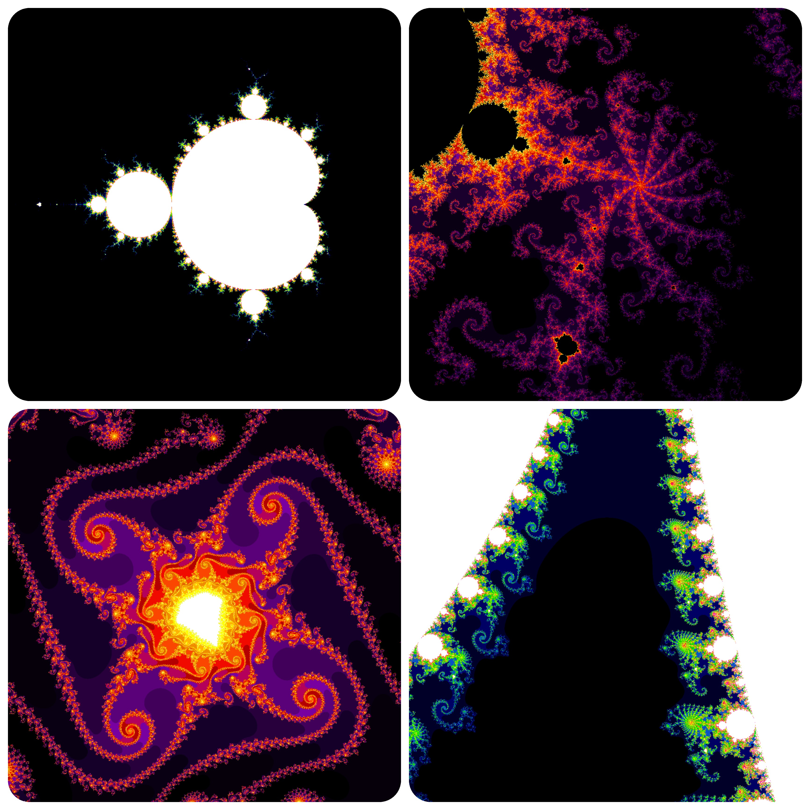
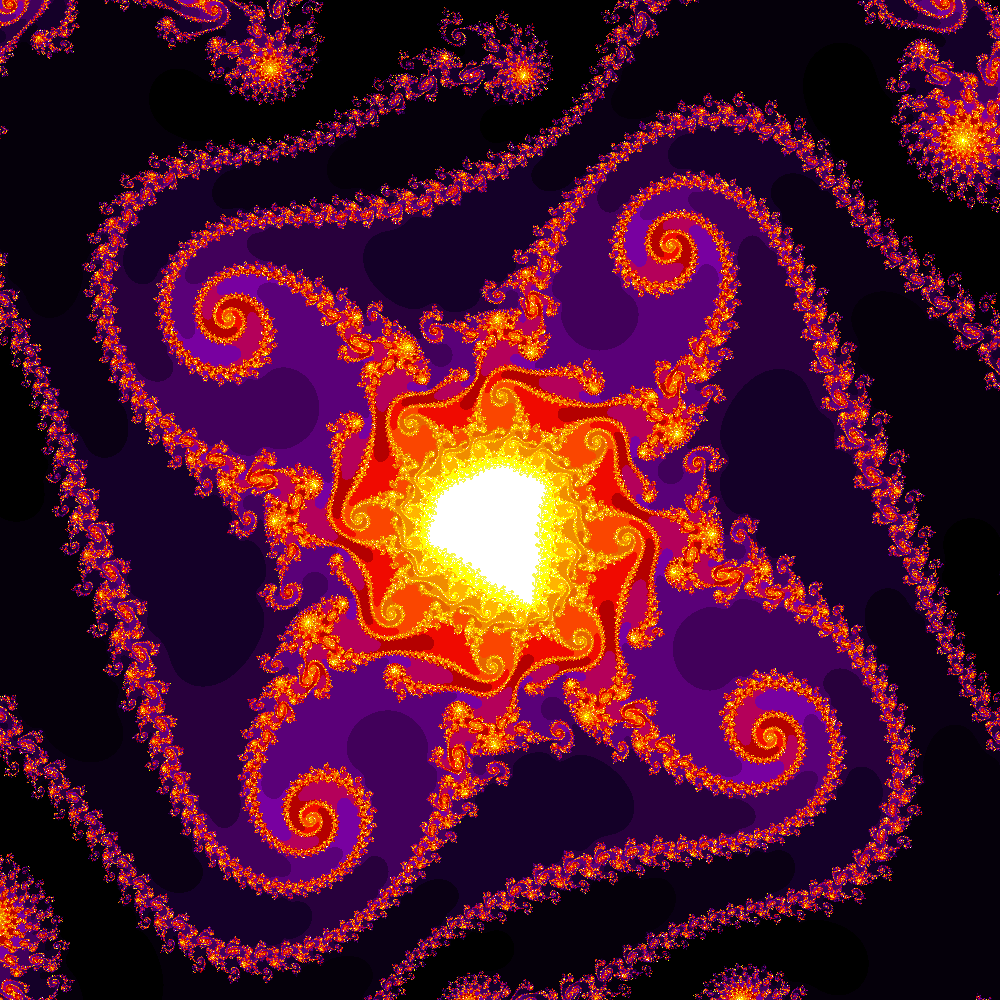
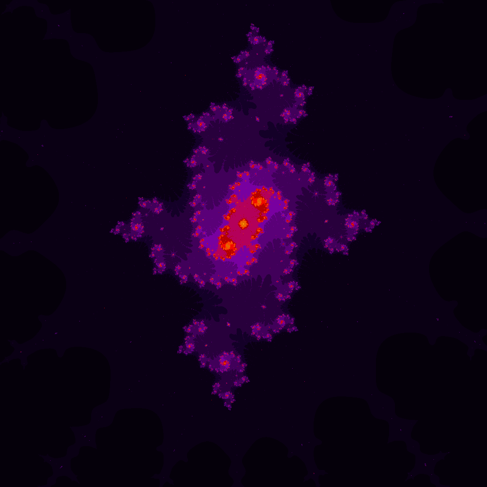

# Conjunto de Mandelbrot

O Conjunto de Mandelbrot é um fractal obtido usando números complexos iterando a equação 

Zn+1 = Zn2 + C, onde Z é um número complexo e C é o número complexo que será verificado se está ou não no Conjunto de Mandelbrot.

A cada iteração, é checado se o módulo do número complexo Z ultrapassa 2; caso sim, o número “explode” ao infinito e está fora do Conjunto. Caso contrário, o número estará dentro do fractal.

Por exemplo, o número C = 1 + 0i:

Zn+1 = Zn2 + C  
Z0 = 02 + 1 = 1. <i>  (O resultado passa a ser o Z que será utilizado na próxima iteração. C permanece igual a 1).</i>  
Z1 = 12 + 1 = 2  
Z2 = 22 + 1 = 5  
Z3 = 52 + 1 = 26  
...

Como visto, o número 1 + 0i vai crescer ao infinito, estando, portanto, fora do Conjunto de Mandelbrot.

Esse cálculo será feito para cada pixel na imagem; se o número correspondente àquele pixel estiver no Conjunto, receberá a cor preta; se não, receberá uma cor de acordo com o número de iterações efetuadas até seu módulo ultrapassar 2.

Mais sobre o [Conjunto de Mandelbrot](https://pt.mathigon.org/course/fractals/mandelbrot).

# Sobre o programa
Um arquivo .ppm será criado para guardar as cores dos pixels. Para visualizar a imagem gerada, converter o formato é necessário e pode ser feito pelo [Pixillion](https://www.nchsoftware.com/imageconverter/index.html). O formato .png é mais adequado para uma boa qualidade. Mais sobre o formato .ppm [aqui.](https://www.vivaolinux.com.br/artigo/Manipulacao-de-imagens-no-formato-PPM#:~:text=O%20formato%20ppm%20%C3%A9%20usado,arquivos%20com%20o%20padr%C3%A3o%20bin%C3%A1rio.&text=O%20valor%20m%C3%A1ximo%20de%20cada,0%20at%C3%A9%20255%20(inclusive).)

Para uma imagem com a proporção 1:1, (RE_INICIO – RE_FINAL) = (IM_INICIO – IM_FINAL), ou seja, a distância entre o número real inicial e o final será igual a distância entre o primeiro número imaginário e o último.
Para outras proporções de imagem, utilizar a seguinte regra de três: 

(RE_FINAL – RE_INICIO)/ COMP = (IM_FINAL - IM_INICIO) / ALT, sendo COMP e ALT o comprimento e a altura (em pixels) da imagem, respectivamente.

Mais instruções no código.

Obs.: Devido a questões de performance, a biblioteca  <i>complex.h</i> não foi utilizada. Em seu lugar, uma implementação manual dos números complexos foi feita utilizando de números reais. A operações com números complexos utilizadas são explicadas [aqui](https://www.mathsisfun.com/algebra/complex-number-multiply.html).

# Imagens Obtidas
Duas paletas de cores foram utilizadas, <i>Temperature</i> e <i>Rainbow</i> e estão disponíveis no código. É possível customizar outros intervalos de cores RGB para imagens diferentes.

Todas as imagens a seguir foram obtidas com o programa. As [imagens originais](high_res_images) têm o tamanho 10.000 x 10.000 pixels. Resoluções maiores podem ser obtidas.
   
 

                 

<pre>
  600 iterações                                                                  1000 iterações
  Coordernadas: x: -0.7709531; y: -0.115621                                      Coodernada: x: -0.7995; y: -0.166
</pre>
 

 

                  

<pre>
  1000 iterações                                                             1000 iterações
  Coordernadas: x: -0.76; y: -0.14                                           Coodernada: x: -0.5; y: 0
</pre>
 

 
                  

<pre>
  3000 iterações
  Coordernadas: x: -1.5754594256; y: 0.00021761610
</pre>
